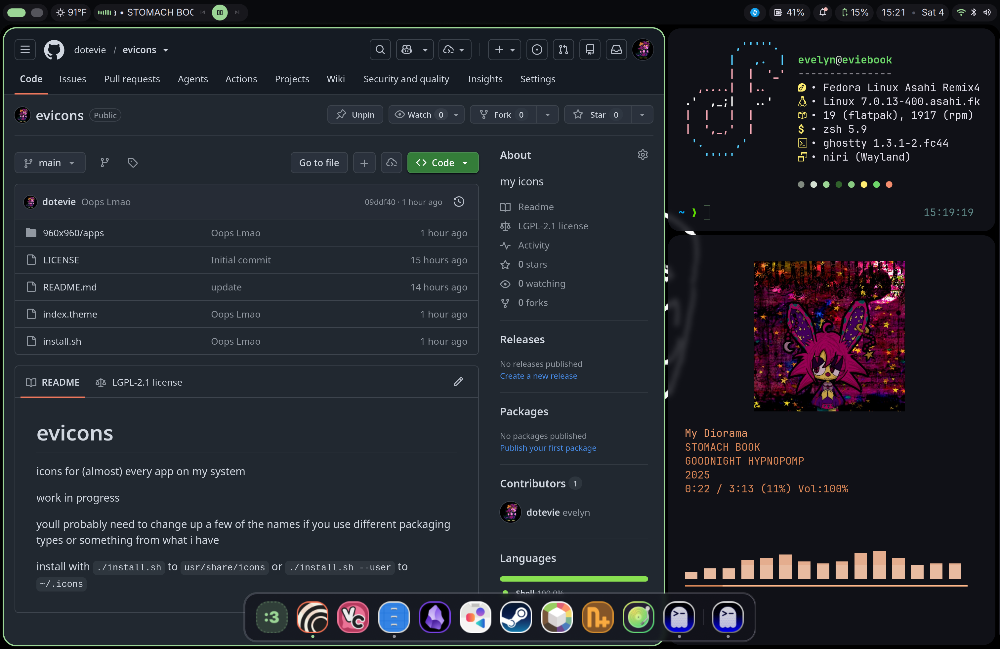

# my dotfiles

dotfiles for my laptop (14 inch macbook pro 2021)

i've redone it a bit so hopefully it should be easier to maintain now, report issues if you have em :3

required:
- [niri](https://github.com/yalter/niri) ^v26.04
- [dms (dms-git probably)](https://danklinux.com)
- [Bibata Modern Classic cursor](https://store.kde.org/p/1914825) wherever you store your cursors

recommended for all keybinds to work:
- hyprpicker
- zsh
- [Emote](https://flathub.org/en/apps/com.tomjwatson.Emote) emoji picker Flatpak
- wl-copy and wl-paste
- notify-send
- playerctl
- systemd/logind

### icon pack (wip)
i'm working on an icon pack for all the apps i use regularly. you can find it at [dotevie/evicons](https://github.com/dotevie/evicons)

### how to install (more or less)
- install niri and dms (easiest through `curl https://install.danklinux.com | sh`)
- copy `DankMaterialShell`, `fastfetch`, `niri`, and `hyfetch.json`into `~/.config`
- copy `userChrome.css` in `firefox_css` folder into the `chrome` folder in your Firefox userprofile directory (make sure stylesheets are enabled)
- copy the scripts in `scripts` to `~/.local/bin` or wherever you like
- add `appledrm.show_notch=1` to your kargs to enable notched rendering
- if you want the icons, clone `dotevie/evicons` and run `./install.sh --user`
- !!! important for sleep key function like in macos !!!: copy `/usr/lib/systemd/logind.conf` to `/etc/systemd/logind.conf`, uncomment `HandleSuspendKey`, and set it to `ignore`, then reboot
- set your wallpaper to `wallpaper.png` if you like :3

### extra things:
- laptop: 14 inch macbook pro 2021
- distro: Fedora Workstation Asahi Remix 44
- music player: kew
- fetch thing(??): hyfetch + fastfetch
- browser: Zen
- wallpaper: made with art from [@d6016.bsky.social](https://bsky.app/profile/d6016.bsky.social/post/3lcgyu6fohc2b)
- `userChrome.css` file inside `firefox_css` lowers minimum firefox width in order to make 33% look fine
